# AIGrid Product Requirements Document (PRD V2.0)

## 1. Product Vision

**Building an AI Collaboration Hub for the Intelligent Era**

Providing professional users with a secure and efficient multi-AI service management platform that achieves:

- 🚀 Cross-platform AI service instant access
- 🔒 Enterprise-grade data security
- 🧩 Extensible service integration architecture
- 📊 Intelligent resource scheduling

## 2. Core Functional Architecture

### 2.1 Authentication Management System

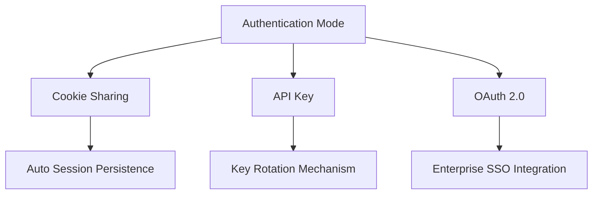

### 2.2 Service Integration Matrix

| Service | Phase | Auth Method | Features |
|---------|-------|-------------|-----------|
| ChatGPT | 1.0 | Cookie Sharing | Real-time Chat Sync |
| DeepSeek | 1.5 | API Key | Stream Response |
| Custom Service | 2.0 | OpenAPI Spec | Dynamic Loading |
| Claude | Enterprise | OAuth 2.0 | Team Access Control |

### 2.3 Enhanced Feature Stack (Updated)

#### 2.3.1 Layout Components

1. Adjustable Side Panel
   - Collapsible control panel
   - Quick settings access
   - Model fullscreen shortcuts
   - Session management
   - Width range: 240px - 320px

2. Unified Input Interface
   - Fixed bottom position
   - Multi-line support (1-5 lines)
   - Auto-scroll for overflow
   - Visible last 5 lines
   - Character count & model status

3. Layout Control
   - Quick layout switching icons
   - Supported layouts:
     - 1/2 split (vertical)
     - 1/3 split (vertical)
     - 2x2 grid
   - Visual layout preview
   - Layout persistence

4. Model Windows
   - Title bar with integrated status indicator (small dot: green=connected, red=disconnected, yellow=connecting)
   - Status indicator tooltip on hover showing detailed connection state
   - Output-only displays
   - Synchronized scroll state

### 2.4 Grid Window Architecture (Updated)

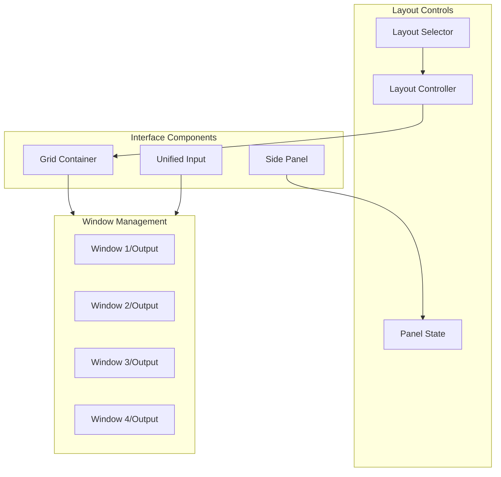

#### 2.4.1 Layout Specifications

1. Side Panel
   - Default width: 280px
   - Collapse trigger: 16px wide
   - Transition: 200ms ease-in-out
   - Z-index: Above grid windows

2. Input Area
   - Height: Dynamic (24px - 120px)
   - Max lines: 5
   - Overflow behavior: Scroll
   - Position: Fixed bottom
   - Z-index: Highest
   - Border: 1px solid #E5E7EB
   - Border radius: 8px top edges
   - Background: White
   - Box shadow: 0 -4px 6px -1px rgba(0, 0, 0, 0.1)
   - Padding: 12px 16px
   - Margin: 0 16px 16px 16px

3. Grid Layouts
   - 1/2 split: 50% each
   - 1/3 split: 33.33% each
   - 2x2: 50% width, 50% height
   - Gutters: 8px
   - Minimum window size: 320px

4. Responsive Behavior
   - Breakpoints: 1024px, 1440px, 1920px
   - Column collapse: < 768px
   - Side panel auto-collapse: < 1024px
   - Layout restrictions on smaller screens

### 2.5 Window Interaction Model

```typescript
interface GridWindowConfig {
  layout: {
    type: 'grid' | 'horizontal' | 'vertical' | 'custom';
    dimensions: {
      columns: number;
      rows: number;
    };
    windows: Array<{
      id: string;
      service: 'chatgpt' | 'claude' | 'custom';
      position: {
        x: number;
        y: number;
        width: number;
        height: number;
      };
      state: {
        isActive: boolean;
        isMinimized: boolean;
        zIndex: number;
      };
    }>;
  };
  persistence: {
    saveLayout: boolean;
    saveSession: boolean;
    syncInterval: number;  // milliseconds
  };
  shortcuts: {
    toggleLayout: string;  // e.g., "Ctrl+Shift+G"
    cycleWindows: string;
    maximizeWindow: string;
  };
}
```

### 2.6 User Interaction Flows

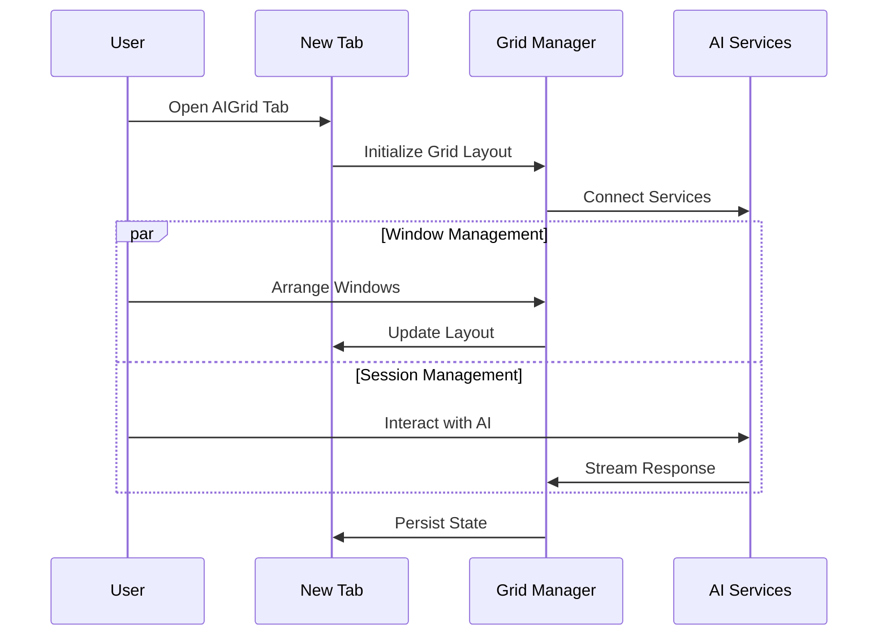

## 3. Technical Architecture

### 3.1 Layered Architecture

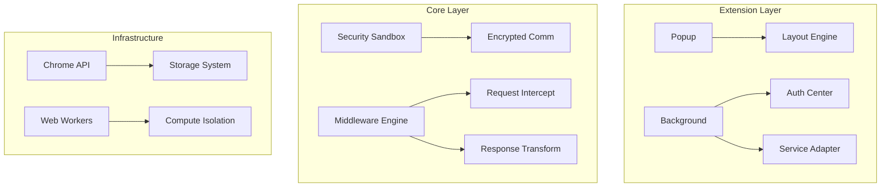

### 3.2 Data Flow Architecture

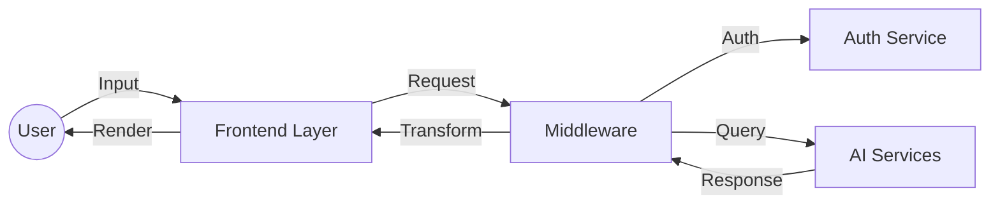

### 3.3 Component Interaction

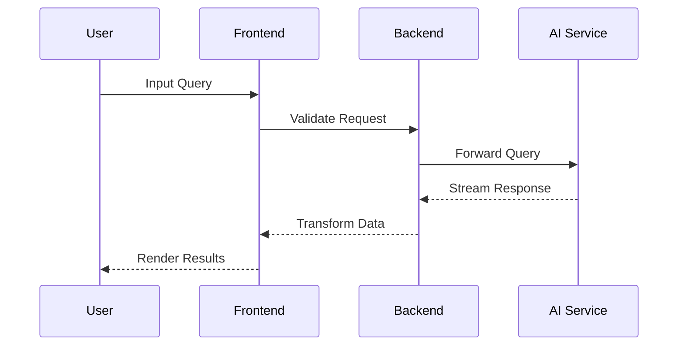

### 3.4 Deployment Architecture

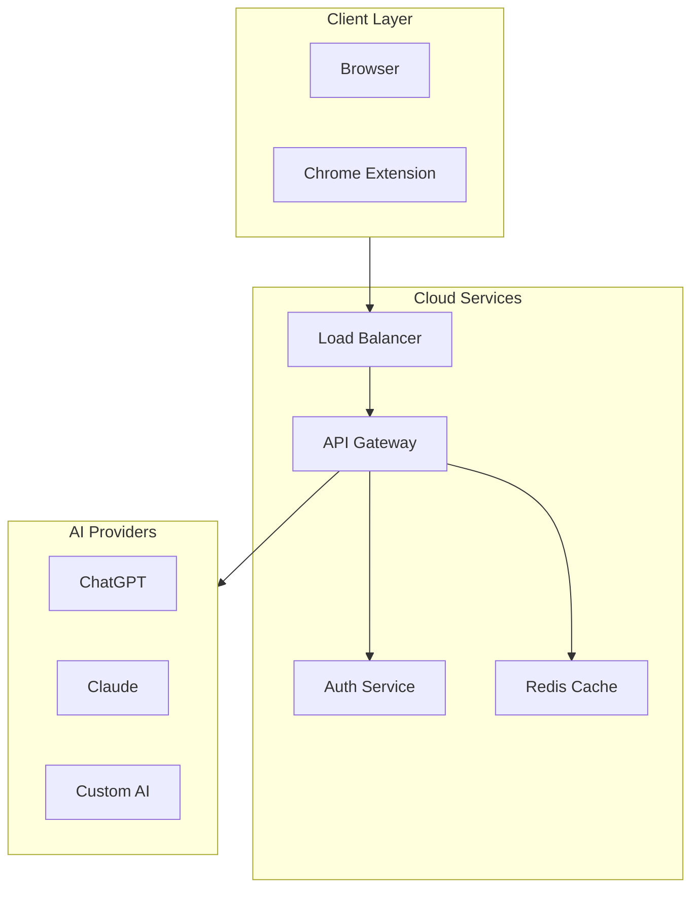

### 3.5 Security Architecture

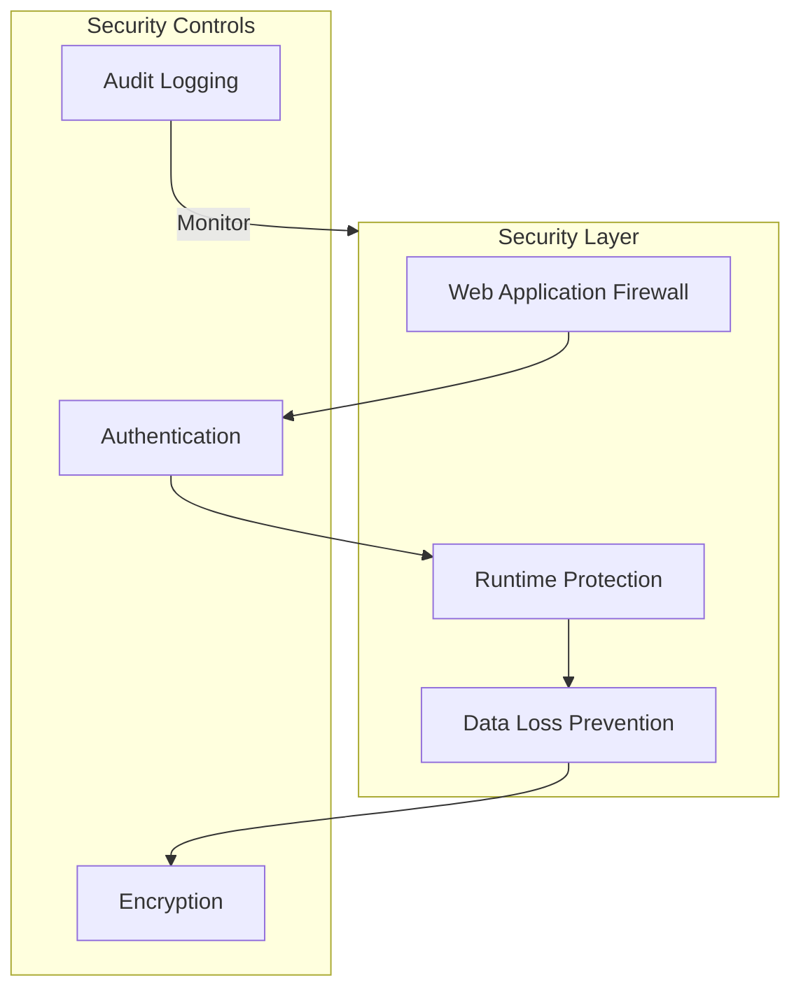

### 3.6 Error Handling Flow

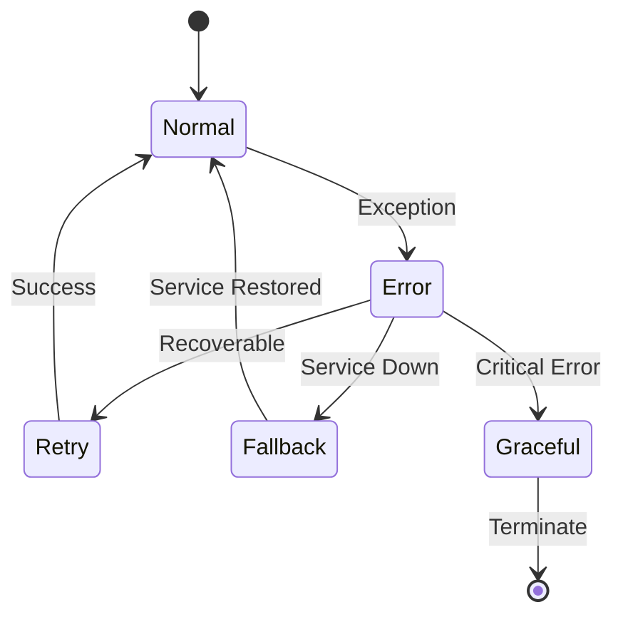

### 3.7 Data Persistence Model

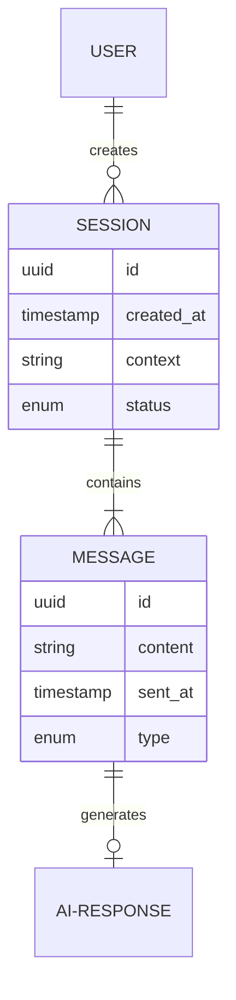

### 3.8 Service Discovery Architecture

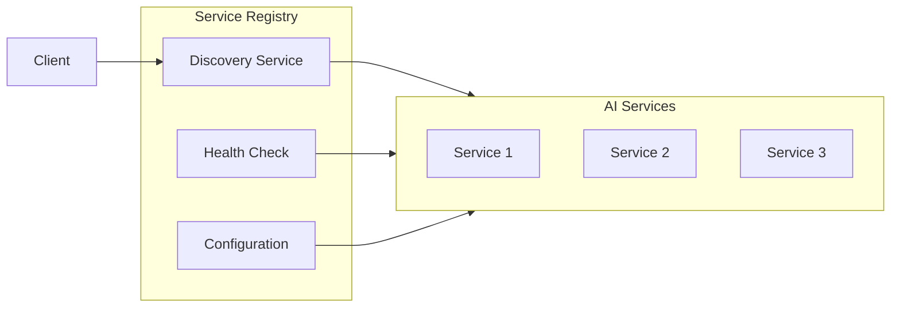

### 3.9 Performance Monitoring

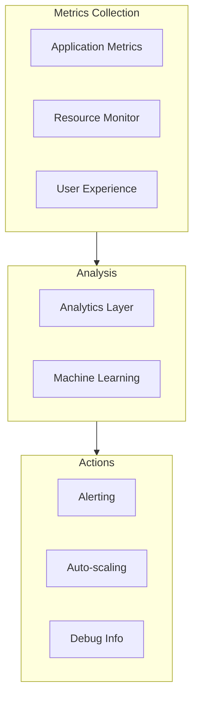

### 3.10 CI/CD Pipeline

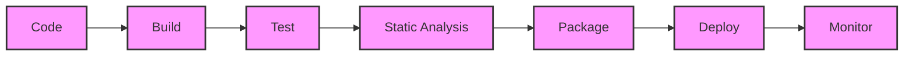

## 4. Implementation Details

### 4.1 Frontend Technology Stack

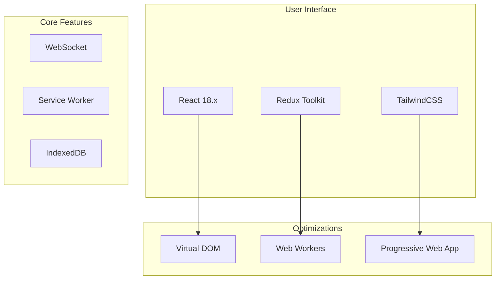

### 4.2 Backend Service Architecture

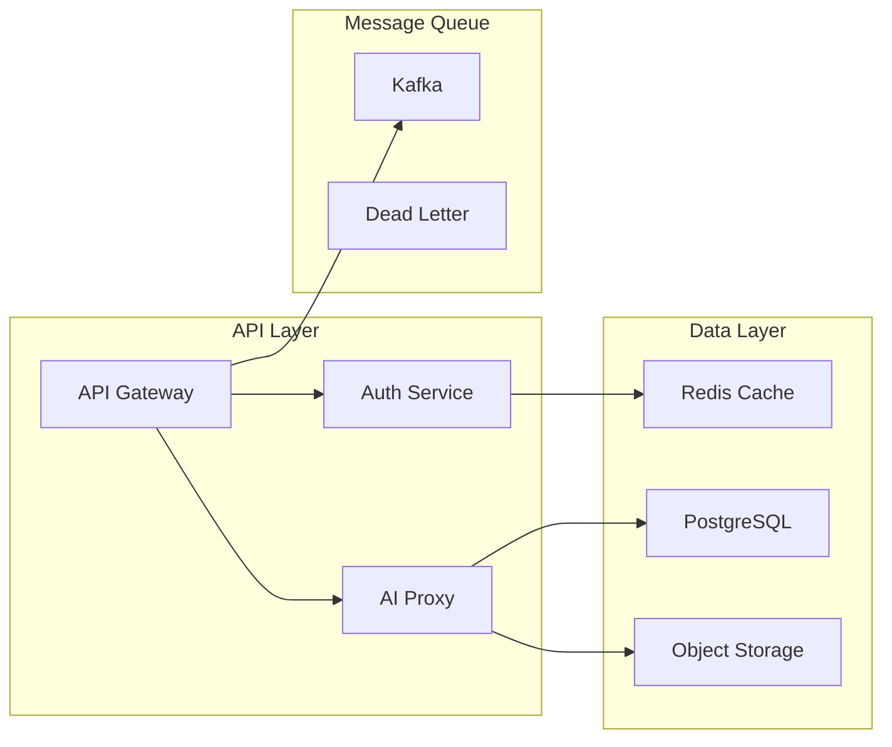

### 4.3 Key Dependencies

| Category | Component | Version | Purpose |
|----------|-----------|---------|----------|
| Frontend | React | 18.x | UI Framework |
| Frontend | Redux Toolkit | 2.x | State Management |
| Frontend | TailwindCSS | 3.x | Styling |
| Backend | Node.js | 20.x LTS | Runtime |
| Backend | PostgreSQL | 15.x | Primary Database |
| Backend | Redis | 7.x | Caching Layer |
| DevOps | Docker | Latest | Containerization |

### 4.4 API Interface Specifications

```typescript
interface AIServiceConfig {
  endpoint: string;
  version: string;
  authType: 'cookie' | 'apikey' | 'oauth';
  capabilities: {
    streaming: boolean;
    functionCalling: boolean;
    contextWindow: number;
  };
}

interface ChatMessage {
  id: string;
  role: 'user' | 'assistant' | 'system';
  content: string;
  timestamp: Date;
  metadata?: Record<string, unknown>;
}

interface ChatSession {
  id: string;
  userId: string;
  serviceId: string;
  messages: ChatMessage[];
  status: 'active' | 'archived' | 'error';
  context?: Record<string, unknown>;
}
```

### 4.5 Performance Requirements

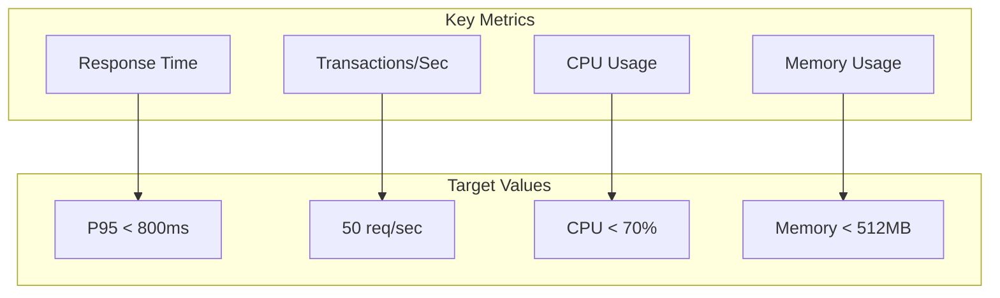

## 5. Testing & Quality Assurance

### 5.1 Testing Strategy Matrix

| Level | Type | Tools | Coverage Target |
|-------|------|-------|-----------------|
| Unit | Jest + React Testing Library | Component isolation | 85% |
| Integration | Playwright | Cross-service flows | 70% |
| E2E | Selenium + Chrome Driver | Critical paths | 50% |
| Performance | Lighthouse + WebPageTest | Core web vitals | P95 targets |

### 5.2 Test Architecture

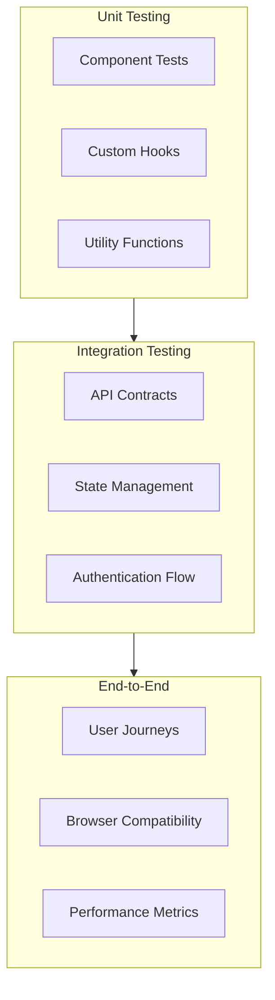

### 5.3 Quality Gates

```typescript
interface QualityGate {
  metrics: {
    codeCoverage: number;     // Minimum 85%
    duplicateLines: number;   // Maximum 3%
    cyclomaticComplexity: number; // Maximum 15
    maintainabilityIndex: number; // Minimum 70
  };
  security: {
    vulnerabilities: 'none';
    outdatedDependencies: 'none';
    secretLeaks: 'blocked';
  };
  performance: {
    lighthouse: {
      performance: number;    // Minimum 90
      accessibility: number;  // Minimum 95
      bestPractices: number; // Minimum 90
    };
  };
}
```

### 5.4 Automated Test Suites

```yaml
test-suites:
  unit:
    - name: Components
      runner: jest
      pattern: "**/*.test.tsx"
      timeout: 10000
    - name: Hooks
      runner: jest
      pattern: "**/*.hook.test.ts"
      timeout: 5000
    
  integration:
    - name: API
      runner: playwright
      specs: "tests/api/**/*.spec.ts"
      retries: 2
    
  e2e:
    - name: Critical Paths
      runner: selenium
      specs: "tests/e2e/**/*.spec.ts"
      browsers: 
        - chrome
        - firefox
```

### 5.5 Performance Testing Scenarios

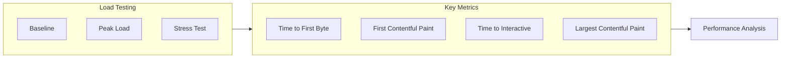

### 5.6 Bug Management Process

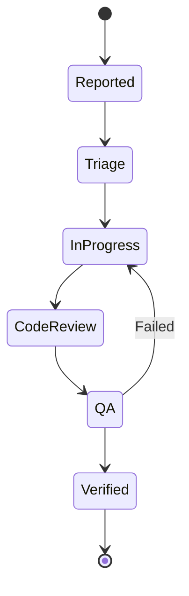

## 6. Security & Compliance

### 6.1 Security Architecture Overview

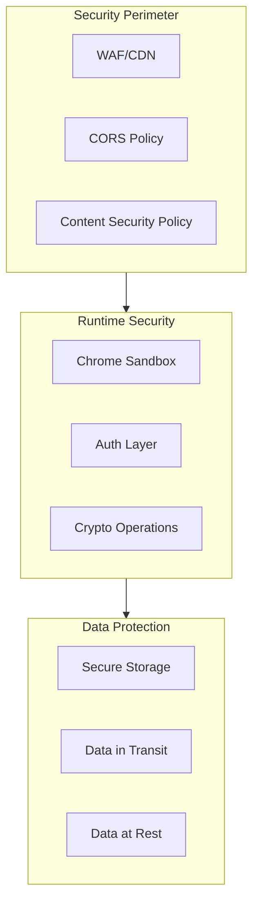

### 6.2 Authentication & Authorization Matrix

| Service Type | Auth Method | Token Lifetime | Refresh Strategy |
|-------------|-------------|----------------|------------------|
| ChatGPT | Cookie-based | 2 weeks | Session heartbeat |
| Claude | OAuth 2.0 | 1 hour | Refresh token |
| Custom API | API Key | 30 days | Manual rotation |
| Admin Panel | JWT + MFA | 24 hours | Silent refresh |

### 6.3 Data Protection Requirements

```typescript
interface SecurityRequirements {
  encryption: {
    algorithm: 'AES-256-GCM';
    keyManagement: {
      rotation: number; // days
      storage: 'secure-enclave' | 'tpm';
    };
    scope: {
      inTransit: boolean;
      atRest: boolean;
      inMemory: boolean;
    };
  };
  
  sanitization: {
    input: string[];  // XSS prevention rules
    output: string[]; // Content sanitization rules
    logging: {
      pii: string[];
      excluded: string[];
    };
  };
}
```

### 6.4 Compliance Requirements

```mermaid
mindmap
    root((Compliance))
        GDPR
            Data Protection
            User Rights
            Breach Notification
        CCPA
            Privacy Policy
            Data Collection
            Opt-out Mechanism
        SOC2
            Security
            Availability
            Confidentiality
        HIPAA
            PHI Protection
            Access Controls
            Audit Trails
```

### 6.5 Security Monitoring & Response

```yaml
monitoring:
  alerts:
    - name: authentication-failure
      threshold: 5
      window: 5m
      severity: high
    - name: api-error-rate
      threshold: 10%
      window: 15m
      severity: medium
    - name: data-access-anomaly
      threshold: 3
      window: 1h
      severity: critical

response:
  procedures:
    authentication-breach:
      - suspend-affected-tokens
      - notify-security-team
      - initiate-investigation
    data-leak:
      - isolate-affected-systems
      - revoke-credentials
      - engage-incident-response
```

### 6.6 Regular Security Assessment

```mermaid
gantt
    title Security Assessment Timeline
    dateFormat  YYYY-MM-DD
    
    section Automated
    Daily Scans       :daily, 2024-01-01, 365d
    Dependency Checks :deps,  2024-01-01, 365d
    
    section Manual
    Penetration Testing :active, pt1, 2024-03-01, 30d
    Code Review        :active, cr1, 2024-02-01, 28d
    Architecture Review :active, ar1, 2024-01-15, 45d
```

## 7. Rollout & Release Strategy

### 7.1 Release Timeline

```mermaid
gantt
    title AIGrid Release Timeline 2024
    dateFormat YYYY-MM-DD
    
    section Alpha
    Core Framework     :a1, 2024-03-01, 30d
    ChatGPT Integration:a2, after a1, 20d
    
    section Beta
    DeepSeek & Claude :b1, after a2, 30d
    Enterprise Features:b2, after b1, 25d
    
    section RC
    Performance Tuning :rc1, after b2, 15d
    Security Audit    :rc2, after rc1, 10d
```

### 7.2 Feature Flag Configuration

```typescript
interface FeatureFlags {
  readonly environment: 'dev' | 'staging' | 'prod';
  features: {
    [key: string]: {
      enabled: boolean;
      rolloutPercentage: number;
      allowlist: string[];
      requirements: {
        minVersion: string;
        dependencies: string[];
      };
    };
  };
}

const defaultFlags: FeatureFlags = {
  environment: 'prod',
  features: {
    streamingResponse: {
      enabled: true,
      rolloutPercentage: 25,
      allowlist: ['enterprise'],
      requirements: {
        minVersion: '2.0.0',
        dependencies: ['websocket']
      }
    }
  }
};
```

### 7.3 Migration Strategy

```yaml
migrations:
  v1_to_v2:
    data:
      - type: schema
        priority: high
        backfill: true
        rollback: available
      - type: storage
        priority: medium
        backup: required
    
    features:
      - oldFeature: single-ai
        newFeature: multi-ai
        coexistence: 30d
      
    compatibility:
      minVersion: '1.5.0'
      gracePeriod: 60d
```

### 7.4 Rollback Procedures

```mermaid
stateDiagram-v2
    [*] --> Monitoring
    Monitoring --> IssueDetected: Threshold Breach
    IssueDetected --> Assessment
    Assessment --> MinorIssue: Low Impact
    Assessment --> MajorIssue: High Impact
    MinorIssue --> HotFix
    MajorIssue --> Rollback
    HotFix --> Monitoring
    Rollback --> PreviousVersion
    PreviousVersion --> Monitoring
```

### 7.5 Beta Testing Program

```typescript
interface BetaProgram {
  phases: {
    internal: {
      duration: number;  // days
      participants: number;
      successCriteria: string[];
    };
    enterprise: {
      duration: number;
      maxAccounts: number;
      features: string[];
    };
    public: {
      maxUsers: number;
      graduationCriteria: {
        stability: number;  // percentage
        usage: number;     // daily active users
        satisfaction: number;  // NPS score
      };
    };
  };
}
```

### 7.6 Communication Plan

```mermaid
graph TD
    subgraph Internal[Internal Comms]
        Dev[Development]
        CS[Customer Support]
        Sales[Sales Team]
    end
    
    subgraph External[External Comms]
        Docs[Documentation]
        Blog[Blog Posts]
        Social[Social Media]
    end
    
    subgraph Timeline[Release Timeline]
        Pre[Pre-release]
        Launch[Launch Day]
        Post[Post-release]
    end
    
    Internal --> Timeline
    External --> Timeline
```

## 8. Documentation & References

### 8.1 API Documentation

Based on [OpenAPI Specification 3.1.0](https://spec.openapis.org/oas/v3.1.0)

```yaml
openapi: 3.1.0
info:
  title: AIGrid Extension API
  version: 2.0.0
  description: Chrome extension for AI service management
servers:
  - url: https://api.aigrid.dev/v2
    description: Development server
paths:
  /sessions:
    get:
      summary: List chat sessions
      security:
        - bearerAuth: []
    post:
      summary: Create new session
      security:
        - bearerAuth: []
components:
  securitySchemes:
    bearerAuth:
      type: http
      scheme: bearer
```

### 8.2 Chrome Extension APIs

Based on [Chrome Extension Reference](https://developer.chrome.com/docs/extensions/reference/api)

```typescript
interface ChromeAPIsUsage {
  storage: {
    sync: ['config', 'preferences'];
    local: ['sessions', 'cache'];
    managed: ['enterprise-policy'];
  };
  cookies: {
    domains: ['chat.openai.com', 'claude.ai'];
    permissions: ['read', 'write'];
  };
  runtime: {
    messaging: ['long-lived', 'port-based'];
    contentScripts: ['dynamic-injection'];
  };
}
```

### 8.3 AI Ethics & Transparency

Based on [Partnership on AI Guidelines](https://partnershiponai.org/workstream/about-ml/)

```mermaid
mindmap
    root((AI Ethics))
        Transparency
            Model Cards
            Data Sources
            Limitations
        Privacy
            Data Handling
            User Control
            Retention
        Fairness
            Bias Detection
            Equal Access
            Monitoring
        Security
            Access Control
            Data Protection
            Audit Trails
```

### 8.4 Technical Documentation Structure

```mermaid
graph TD
    subgraph UserDocs[User Documentation]
        Install[Installation Guide]
        Config[Configuration]
        Usage[Usage Guide]
    end
    
    subgraph DevDocs[Developer Documentation]
        API[API Reference]
        Arch[Architecture]
        Deploy[Deployment]
    end
    
    subgraph AdminDocs[Admin Documentation]
        Security[Security Guide]
        Monitor[Monitoring]
        Maintain[Maintenance]
    end

    UserDocs --> DevDocs
    DevDocs --> AdminDocs
```

### 8.5 Version History & Changelog

```yaml
versions:
  2.0.0:
    date: 2024-02-15
    changes:
      - type: feature
        description: Multi-AI service support
      - type: security
        description: Enhanced encryption
      - type: performance
        description: WebGL acceleration
  
  1.5.0:
    date: 2024-01-01
    changes:
      - type: feature
        description: Claude integration
      - type: improvement
        description: Response streaming
```
